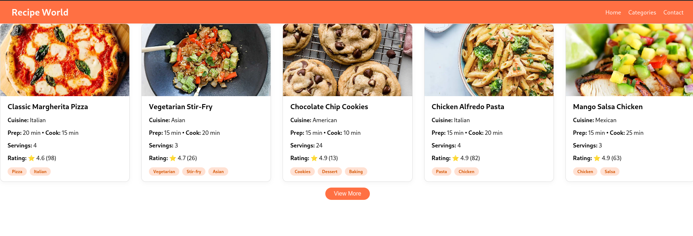
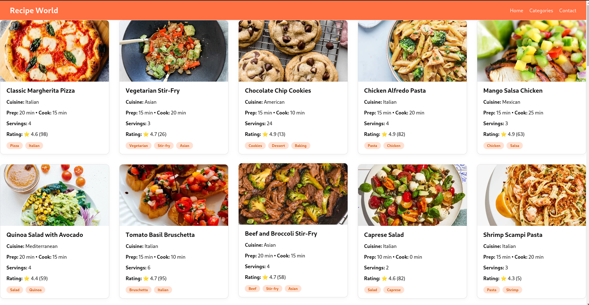

# 🍕 Recipe World  
**Group 5**

## 🔍 Description  
A simple React-based UI that fetches and displays recipes in responsive cards.  
Includes a "View More" feature to control how many recipes appear at once.

## 📸 Screenshot  
  


## 🛠️ Tech Stack  
- React 18  
- Plain CSS (modular per component)  
- Fetch API  

## 🚀 How to Run  
```bash
npm install
npm start
